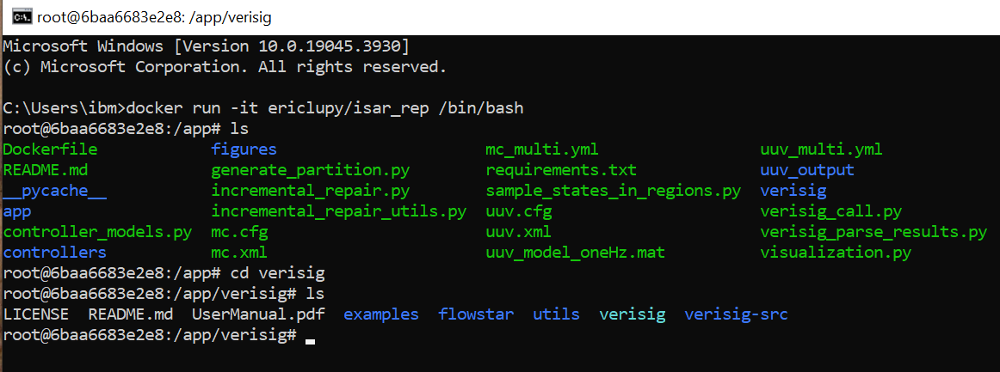
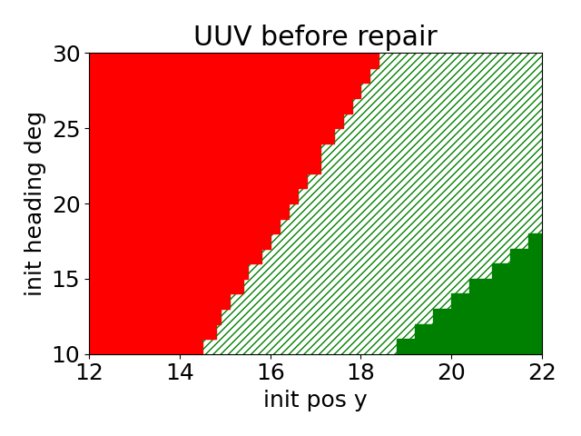

# Repeatability Package of Incremental Simulated Annealing Repair with Interpolation (ISAR-I)

### Step 0: Start the Docker image

This is the repeatability package for the ICCPS 2025 Submission "Accelerating Neural Policy Repair with Preservation via Stability-Plasticity Interpolation", and its extension projects.
Please note: the following instructions are for the Dockerized application.

**There is no need to pull any file from this repo.** The Docker image is available on our [Docker Hub repo](https://hub.docker.com/repository/docker/ericlupy/isar_interpolation).
Again, there is no need to pull anything from there either. To run our code, simply install [Docker](https://www.docker.com/) and in your command line terminal, pull our Docker image by
```
docker pull ericlupy/isar_interpolation:latest
```
and then run the image in interactive mode by
```
docker run -it ericlupy/isar_interpolation /bin/bash
```
This will start a Docker container that loads our image, and an interactive Linux shell will be available. The shell will be similar to this figure.

This Docker image includes `Ubuntu 20.0.4`, `Python 3.8`, Verisig, and the required packages. After entering the interactive shell,
please follow the instructions below.

> #### Smoke Test Notice
> For the smoke test, we have alternative simple partitions: 6 regions for UUV and 4 for MC (instead of 2000 and 900). This can be enabled by setting `$IF_SMALL` to `True` in command line arguments (by default it is `False`).
> The reason for this option is that running our experiment usually takes days, and this allows a fast smoke test of each step.

> #### Bash scripts
> We provide end-to-end bash scripts. Each run is broken down into 3 scripts.
> - Script 1: An end-to-end run from steps 1 to 5.
> - Script 2: Only calls Verisig and checks the sampled initial states. This is for verification and sampling on flexible networks.
> - Script 3: Visualization of results. This is for the visualization of flexible networks.

For example, to run a small smoke test trial for MC, call
```
./run_small_mc.sh
```
If verification and sampling, or visualization of flexible networks are needed, call `./run_small_mc_verisig.sh` to generate sampling and verification results,
and call `./run_small_mc_visualize.sh` to visualize. Please follow the comments in these two files to modify the variable names before running them.

### Step 1: Generate initial state space partitions

First, we partition the initial state regions by calling

```
python3 generate_partition.py --benchmark="$BENCHMARK"  --small="$IF_SMALL"
```

Here, `$BENCHMARK` can be `uuv` or `mc`. This will generate a partition of initial state space for UUV or MC. The partition is saved as a csv file, with each rectangular
region's lower bound and higher bound of every dimension. The generated file will be a csv file named `uuv_initial_state_regions.csv` or `mc_initial_state_regions.csv`.

### Step 2: Call Verisig to verify the to-be-repaired network

Next, we call Verisig to verify the controller network on each of the partitioned regions. Verification on each region will be run in parallel.
Please notice that we have prepared a `.cfg` and `.xml` file for both UUV and MC. These files encode the system dynamics.
We also have a `...multi.yml` for both. This file encodes the STL specification.

The initial to-be-repaired controller networks are in `/controllers`. Verisig requires `.yml` files for neural network controllers.

With Verisig installed and all files prepared, we call the following code for parallel verification on initial state regions.

```
python3 verisig_call.py --benchmark="$BENCHMARK" --network="$PATH_TO_CONTROL_NETWORK_YML" --verisig_path="$PATH_TO_VERISIG" --verisig_output_path="$PATH_TO_VERISIG_OUTPUT" --cpu_ratio="$RATIO" --initial_state_regions_path="$PATH_TO_PARTITION_CSV"
```
Here, we have

- `$PATH_TO_CONTROL_NETWORK_YML`: the path to the controller network yml, e.g. `controllers/uuv_tanh_2_15_2x32_broken.yml`.
- `$PATH_TO_VERISIG`: the root path of Verisig. By default, Docker will install it at `verisig`.
- `$PATH_TO_VERISIG_OUTPUT`: the path to a directory, where Verisig will save its temporary txt outputs, each txt corresponding to the log of verifying one region, e.g. `verisig/my_uuv_outputs`.
- `$RATIO`: the ratio of CPU being used, a floating point between 0 and 1.
- `$PATH_TO_PARTITION_CSV`: the path to the partition csv file generated in the previous step.

Warning: Running Verisig parallel verification may take a very long time (please expect more than 12 hours), depending on CPU utilization. The logs generated will take some storage (please expect over 1GB).

After all regions are verified, we can parse the results by calling
```
python3 verisig_parse_results.py --benchmark="$BENCHMARK" --network="$PATH_TO_CONTROL_NETWORK_YML" --verisig_output_path="$PATH_TO_VERISIG_OUTPUT" --verisig_parsed_csv="$PATH_TO_VERISIG_PARSED_CSV" --initial_state_regions_csv="$PATH_TO_PARTITION_CSV"
```
The verification of each region will be run in a subprocess and output to a txt log file.
The verification results of all initial state regions will be parsed from Verisig logs and written to another CSV file named `$PATH_TO_VERISIG_PARSED_CSV`.
Execution time of verifying each region will be recorded at the end of every txt log file.

**Please notice that due to randomness (from random sampling of initial states per region and random perturbation in simulated annealing), the output may not necessarily be the same as in our paper.**

### Step 3: Incremental repair

After verification of the to-be-repaired controller is done, we repair the controller using Incremental Simulated Annealing Repair with Interpolation (ISAR-I). 
First, we uniformly sample initial states from each region.
```
python3 sample_states_in_regions.py --benchmark="$BENCHMARK" --network="$PATH_TO_CONTROL_NETWORK_YML" --initial_state_regions_path="$PATH_TO_PARTITION_CSV" --sampled_result_path="$PATH_TO_SAMPLE_RESULT_CSV" --num_samples_per_region="$N_SAMPLES"
```
Here, we have

- `$PATH_TO_SAMPLE_RESULT_CSV`: the path to a new CSV file, where simulated results on the sampled initial states will be saved.
- `$N_SAMPLES`: the number of samples per region, by default 10.

This will sample a fixed number of initial states per region and obtain STL robustness of each sampled state. The result will be written in the specified sampled result path as a csv.

Next, with the initial states sampled, we run the ISAR-I algorithm by calling
```
python3 incremental_repair.py --benchmark="$BENCHMARK" --network="$PATH_TO_CONTROL_NETWORK_YML" --verisig_result_path="$PATH_TO_VERISIG_PARSED_CSV" --sampled_result_path="$PATH_TO_SAMPLE_RESULT_CSV" --output_path="$PATH_TO_OUTPUT"
```
Here, we have

- `$PATH_TO_OUTPUT`: a directory, where final output files, such as repaired network yml files, will be saved, e.g. `my_uuv_final_output_dir`.

This is the main repair algorithm. At every iteration, the network will be checkpointed as both yaml and PyTorch files if the selected region is repaired and no good sampled states are broken.
The new STL robustness on all sampled states will also be checkpointed as csv files.
Please expect that this will take a long time, around 1-2 days. Notice that the system dynamics informaion is encoded in `uuv_model_oneHz.mat`.
Since the repaired network and the new STL robustness will be checkpointed after every iteration, we can always early stop and use one of the checkpoints as the output.
Execution time and the number of 4 cases will be displayed in the standard output.


### Step 4: Verify the repaired network
The repaired network can be verified again using Verisig. It is the same operation as step 2, except that the input network yaml file into `verisig_call.py` is replaced by the repaired file.
Notice that we don't necessarily need to use the very last repaired network - any checkpointed network during the repair procedure can also be verified again and see the outcome.


### Step 5: Visualization
Once we have a verification result and a sampled result (both as csv files) for a controller network, we can visualize the outcome as in our paper.
By calling
```
python3 visualization.py --benchmark="$BENCHMARK" --verisig_result_path="$PATH_TO_VERISIG_PARSED_CSV" --sampled_result_path="$PATH_TO_SAMPLE_RESULT_CSV" --small="$IF_SMALL"
```
It will end up with a plot like the following.



Configurations of this plot, such as title, ticks, and size can be modified in `visualization.py`.
This code will also output the number of the three types of regions,
and the mean and std of min STL robustness in red, non-red, and overall regions (as in our Tables 1 and 3). 
The figure will be saved as a PNG file, with the same name as `$PATH_TO_VERISIG_PARSED_CSV` but with suffix `.png`.

### Baseline Methods
We have implemented command line interfaces to run the baseline methods for both UUV and MC. Here, we use UUV as an example. 
Notice that these baseline methods need the information about bad initial states in the to-be-repaired network, so please prepare a sampled result CSV file using `sample_states_in_regions.py` on the to-be-repaired network.

- STLGym
```
python3 uuv_baselines/uuv_stlgym.py --algo="$RL_ALGO" --steps="$MAX_STEPS" --network="$PATH_TO_CONTROL_NETWORK_YML" --sampled_result_path="$PATH_TO_SAMPLE_RESULT_CSV"
```
where `$RL_ALGO` can be one of `ppo`, `a2c`, and `sac`, and `$MAX_STEPS` is the number of max training steps, by default 10^5. 
The repaired network will be saved as both yml and pth as `uuv_baselines_stlgym_$RL_ALGO$/repaired_net.yml` and `uuv_baselines_stlgym_$RL_ALGO$/repaired_net.pth`.
The yml file can then be evaluated in the same way.

- F-MDP
```
python3 uuv_baselines/uuv_fmdp.py --algo="$RL_ALGO" --steps="$MAX_STEPS" --network="$PATH_TO_CONTROL_NETWORK_YML" --sampled_result_path="$PATH_TO_SAMPLE_RESULT_CSV"
```
The arguments and outputs of F-MDP are similar to STLGym.

- Tube MPC Shielding
```
python3 uuv_baselines/uuv_mpc_shield.py --sampled_result_path="$PATH_TO_SAMPLE_RESULT_CSV"
```
Notice that MPC shielding does not actually modify the network, so no network will be generated. Instead, the outcome of shielding will be output in stdout.
It will generate labeled data for trianing the imitation methods below, as a pkl file, e.g., `dict_mpc_data_ipopt_uuv.pkl`.

- MIQP imitation
```
python3 uuv_baselines/uuv_imitation.py --data_path="$PATH_TO_MPC_PKL" --network="$PATH_TO_CONTROL_NETWORK_YML"  --epochs="$MAX_STEPS" --if_miqp=True
```
This will call MIQP imitation on the labeled data generated by MPC shielding, input as `$PATH_TO_MPC_PKL$`. It outputs the repaired network in the same way as STLGym and F-MDP.

- Minimally deviating repair imitation
```
python3 uuv_baselines/uuv_imitation.py --data_path="$PATH_TO_MPC_PKL" --network="$PATH_TO_CONTROL_NETWORK_YML"  --epochs="$MAX_STEPS" --if_miqp=False
```
This will call minimally deviating repair imitation, with output in the same format as MIQP imitation.
